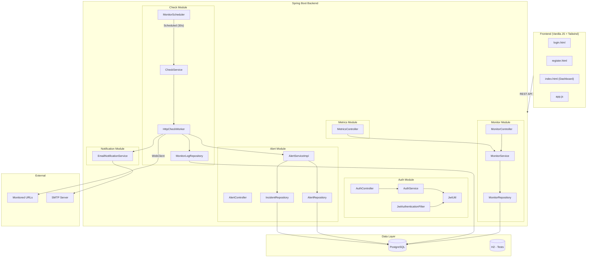
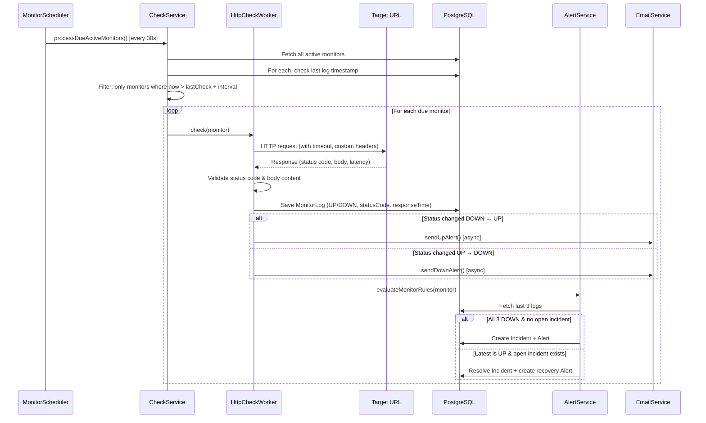
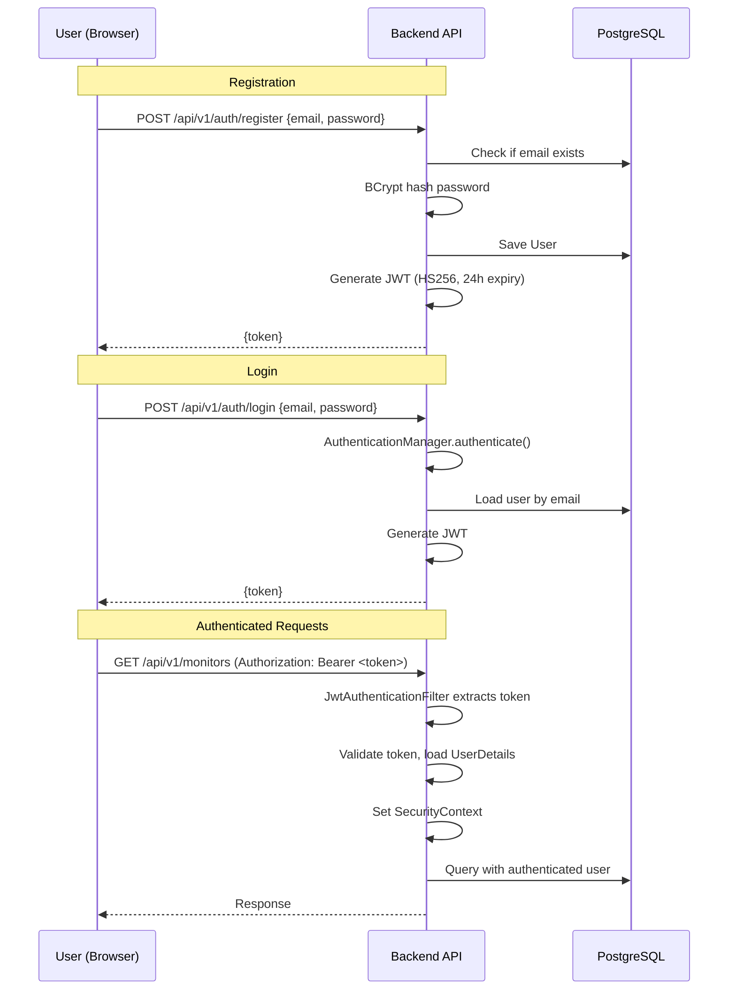
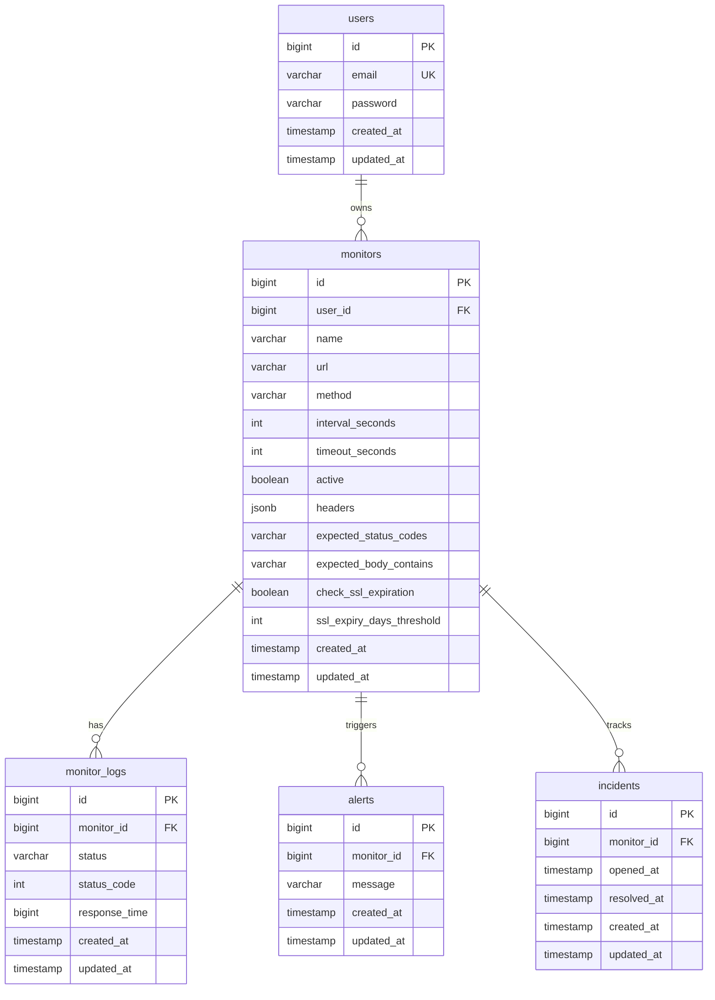
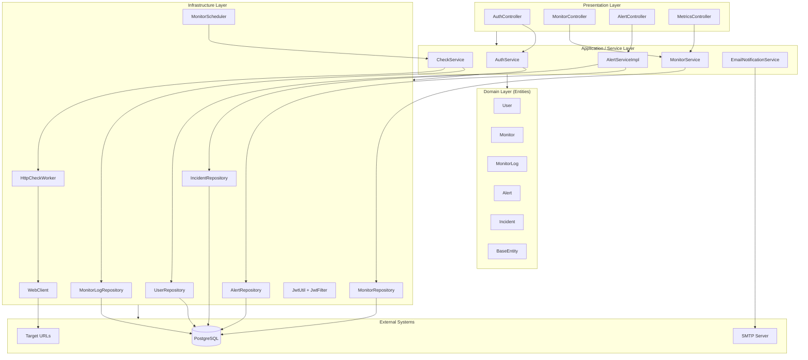
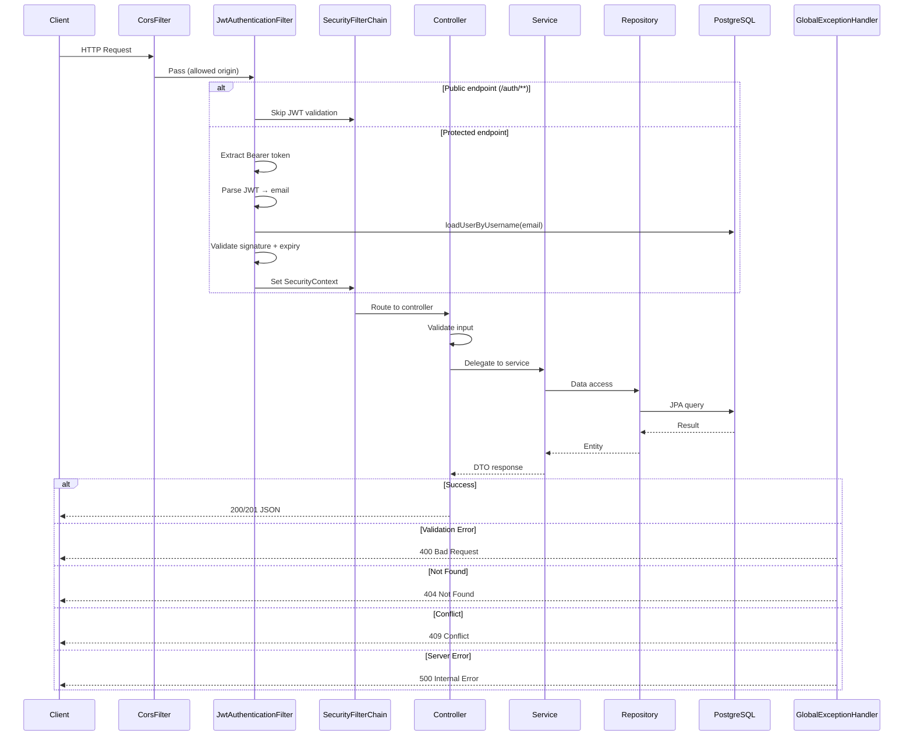
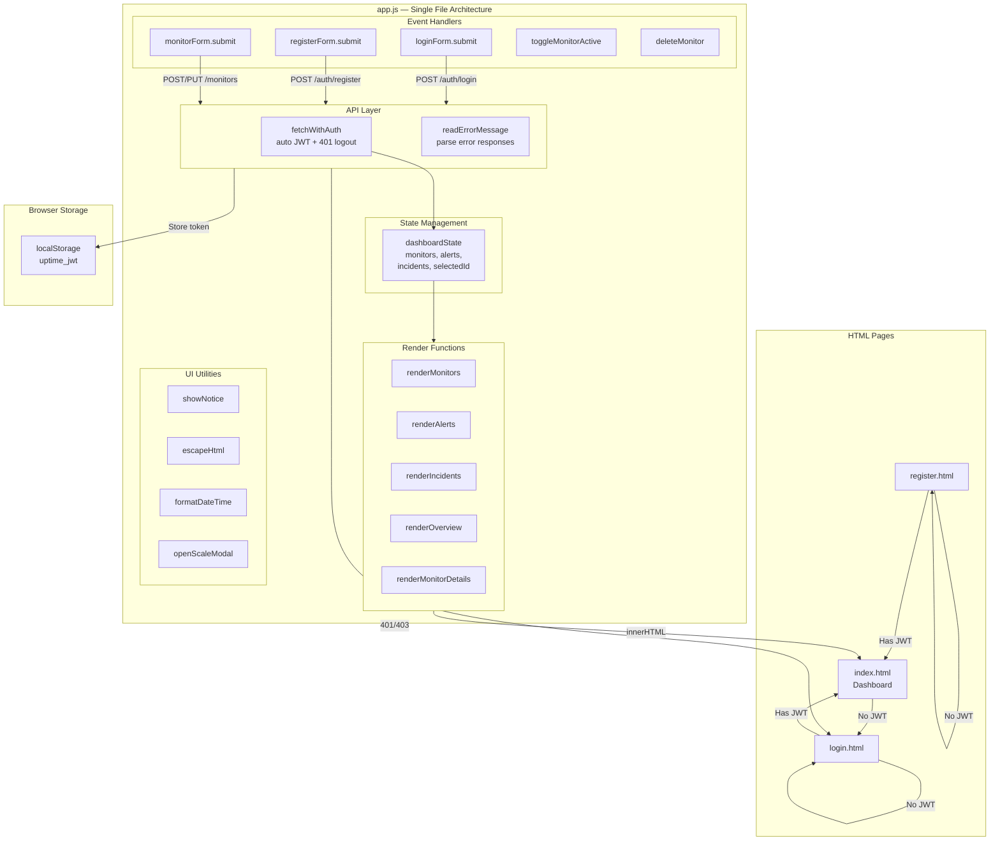
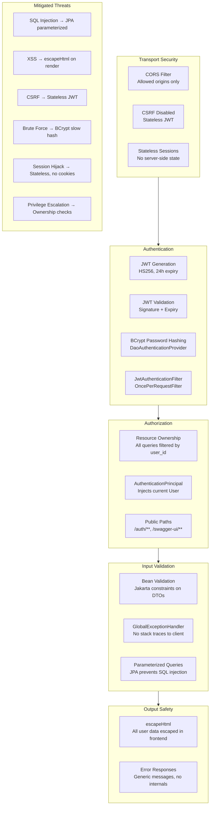

# Uptime Monitoring

A full-stack uptime monitoring application that tracks website/service availability, measures response times, and sends alerts when downtime is detected.

## Tech Stack

| Layer | Technology |
|-------|-----------|
| Backend | Java 17, Spring Boot 3.5.13 |
| Frontend | Vanilla JavaScript, Tailwind CSS (CDN) |
| Database | PostgreSQL 16 (Docker) |
| Migrations | Flyway |
| Auth | JWT (jjwt), Spring Security |
| HTTP Client | Spring WebFlux WebClient (async, non-blocking) |
| Email | Spring Mail (SMTP) |
| API Docs | SpringDoc OpenAPI / Swagger |
| Build | Maven |

---

## Features

### Core Monitoring
- **HTTP Health Checks** — Periodically sends HTTP requests (GET, POST, PUT, DELETE, HEAD, PATCH) to configured URLs and records status
- **Configurable Intervals** — Each monitor has its own check interval (in seconds), independent of others
- **Timeout Handling** — Per-monitor timeout configuration; marks target as DOWN on timeout
- **Custom Headers** — Supports JSON-based custom HTTP headers for authenticated endpoints
- **Status Code Validation** — Validates response against expected status codes (comma-separated list, defaults to 2xx)
- **Body Content Validation** — Optionally checks if response body contains expected string
- **SSL Certificate Monitoring** — Configurable SSL expiry threshold alerts (planned)

### Alerting & Incidents
- **3-Strike Rule** — Incident opens only after 3 consecutive DOWN checks (avoids false positives from transient failures)
- **Auto-Recovery Detection** — Automatically resolves incidents when monitor returns UP
- **Email Notifications** — Sends DOWN/UP alerts via SMTP on status transitions
- **Alert History** — Persists all alert messages with timestamps for audit trail
- **Incident Tracking** — Records outage duration (opened_at → resolved_at) per monitor

### Dashboard & Metrics
- **Real-time Overview** — Total/healthy/failing/pending monitor counts at a glance
- **Latency Percentiles** — P50, P95, P99 response time metrics over configurable time window
- **Uptime Percentage** — Calculated from check history (UP checks / total checks × 100)
- **Check History** — View last N checks with status, HTTP code, and response time
- **Monitor Details** — Deep-dive view with metrics, history timeline, and operational notes

### User Management
- **JWT Authentication** — Stateless auth with 24-hour token expiry
- **BCrypt Password Hashing** — Industry-standard password security
- **Multi-tenant Isolation** — Each user sees only their own monitors, alerts, and incidents
- **Auto-logout** — Frontend automatically redirects to login on 401/403 responses

### Developer Experience
- **Swagger UI** — Interactive API documentation at `/swagger-ui.html`
- **Flyway Migrations** — Version-controlled database schema changes
- **Modular Architecture** — Each domain (auth, monitor, check, alert, notification, metrics) is self-contained
- **Docker PostgreSQL** — One-command database setup via docker-compose

---

## Functional Requirements

| ID | Requirement | Status |
|----|-------------|--------|
| FR-01 | User can register with email and password | ✅ Done |
| FR-02 | User can login and receive JWT token | ✅ Done |
| FR-03 | User can create HTTP monitors with URL, method, interval, timeout | ✅ Done |
| FR-04 | User can update and delete their own monitors | ✅ Done |
| FR-05 | User can pause/resume monitors without deleting them | ✅ Done |
| FR-06 | System checks active monitors at configured intervals | ✅ Done |
| FR-07 | System validates response status code against expected codes | ✅ Done |
| FR-08 | System validates response body contains expected string | ✅ Done |
| FR-09 | System supports custom HTTP headers (JSON format) | ✅ Done |
| FR-10 | System records check results (status, HTTP code, latency) | ✅ Done |
| FR-11 | System sends email notification on status change (UP↔DOWN) | ✅ Done |
| FR-12 | System opens incident after 3 consecutive DOWN checks | ✅ Done |
| FR-13 | System auto-resolves incident when monitor returns UP | ✅ Done |
| FR-14 | User can view uptime %, P50/P95/P99 latency metrics | ✅ Done |
| FR-15 | User can view check history for any time window | ✅ Done |
| FR-16 | User can view recent alerts and incidents | ✅ Done |
| FR-17 | System monitors SSL certificate expiration | 🔲 Planned |
| FR-18 | User can configure alert notification channels (Slack, webhook) | 🔲 Planned |

---

## Non-Functional Requirements

| ID | Requirement | Implementation |
|----|-------------|----------------|
| NFR-01 | **Performance** — Health checks must not block each other | WebFlux WebClient (non-blocking, reactive) |
| NFR-02 | **Scalability** — Support 100+ monitors per user | Scheduler filters only due monitors; async HTTP execution |
| NFR-03 | **Reliability** — Scheduler must survive individual check failures | Try-catch per monitor in scheduler loop; errors logged, not propagated |
| NFR-04 | **Security** — Passwords never stored in plaintext | BCrypt hashing via Spring Security |
| NFR-05 | **Security** — API endpoints protected from unauthorized access | JWT + per-request filter + ownership validation |
| NFR-06 | **Security** — No SQL injection possible | JPA parameterized queries exclusively |
| NFR-07 | **Security** — XSS prevention in frontend | `escapeHtml()` applied to all user-supplied data |
| NFR-08 | **Data Integrity** — Schema changes are versioned and auditable | Flyway migrations; Hibernate in validate-only mode |
| NFR-09 | **Availability** — Database connection resilience | Connection pooling via HikariCP (Spring Boot default) |
| NFR-10 | **Observability** — All check results and alerts are persisted | MonitorLog + Alert + Incident entities with timestamps |
| NFR-11 | **Maintainability** — Modular codebase with clear boundaries | Feature-based package structure (modules/) |
| NFR-12 | **Testability** — Business logic testable in isolation | Service layer with injected dependencies; H2 for tests |
| NFR-13 | **Latency** — API responses under 200ms for CRUD operations | JPA with indexed queries; no N+1 in critical paths |
| NFR-14 | **Deployment** — Minimal infrastructure requirements | Single JAR + PostgreSQL; Docker Compose for DB |

---

## Architecture Overview

The backend follows a **modular monolith** architecture. Each feature domain (auth, monitor, check, alert, notification, metrics) lives in its own package under `com.puspo.uptime.modules` with its own controller, service, repository, entity, and DTO layers.

```
server/src/main/java/com/puspo/uptime/
├── UptimeApplication.java          # Entry point
├── common/                          # Shared base classes & exception handling
│   ├── BaseEntity.java              # JPA superclass (createdAt, updatedAt)
│   └── exception/                   # GlobalExceptionHandler, ConflictException, ResourceNotFoundException
├── config/                          # Spring configuration
│   ├── SecurityConfig.java          # Filter chain, BCrypt, auth provider
│   ├── JwtAuthenticationFilter.java # Extracts & validates JWT from Authorization header
│   ├── JwtUtil.java                 # Token generation, parsing, validation
│   ├── CorsConfig.java              # CORS for frontend
│   ├── WebClientConfig.java         # WebClient bean for async HTTP
│   └── OpenApiConfig.java           # Swagger UI config
└── modules/
    ├── auth/                        # Register, login, JWT issuance
    ├── monitor/                     # CRUD for monitors
    ├── check/                       # Scheduler → service → worker pipeline
    ├── alert/                       # Alert rules, incident tracking
    ├── notification/                # Email dispatch (async)
    └── metrics/                     # Uptime %, latency percentiles
```

## System Architecture



## Monitoring Pipeline

The core monitoring loop follows a **Chain of Responsibility** pattern:



## Authentication Flow



## Database Schema



## Backend Architecture (Layered)



## Request Lifecycle



## Frontend Page Architecture



## Security Architecture



## API Endpoints

All endpoints are prefixed with `/api/v1`. Auth endpoints are public; all others require a JWT Bearer token.

### Auth (`/api/v1/auth`)

| Method | Path | Description |
|--------|------|-------------|
| POST | `/register` | Create account (email, password) |
| POST | `/login` | Authenticate and receive JWT |

### Monitors (`/api/v1/monitors`)

| Method | Path | Description |
|--------|------|-------------|
| GET | `/` | List all monitors for authenticated user |
| POST | `/` | Create a new monitor |
| GET | `/{id}` | Get monitor details |
| PUT | `/{id}` | Update monitor |
| DELETE | `/{id}` | Delete monitor |
| GET | `/{id}/last-check` | Get most recent check result |
| GET | `/{id}/history?hoursBack=24` | Get check history |

### Alerts (`/api/v1/alerts`)

| Method | Path | Description |
|--------|------|-------------|
| GET | `/` | Recent alerts (max 50) |
| GET | `/incidents` | Recent incidents (max 20) |

### Metrics (`/api/v1/metrics`)

| Method | Path | Description |
|--------|------|-------------|
| GET | `/monitor/{monitorId}?hoursBack=24` | Uptime %, latency percentiles (p50/p95/p99) |

### Swagger UI

When the backend is running: `http://localhost:8080/swagger-ui.html`

## Alert Rules

The `AlertServiceImpl` evaluates alerts after every check:

1. Fetch the **last 3 logs** for the monitor
2. If the latest log is **UP**: resolve any open incident, create recovery alert
3. If the latest log is **DOWN** and all 3 recent logs are DOWN and no open incident exists: open a new incident, create alert
4. Email notifications are sent on **status transitions** (UP→DOWN, DOWN→UP) via `EmailNotificationService` (async)

## Frontend

The frontend is a static vanilla JS app with three pages:

| Page | File | Description |
|------|------|-------------|
| Login | `login.html` | Email/password form, stores JWT in localStorage |
| Register | `register.html` | Account creation with password validation |
| Dashboard | `index.html` | Monitor cards, alerts, incidents, create/edit/delete monitors |

Key frontend behaviors:
- **Auto-refresh**: Dashboard polls every 10 seconds via `setInterval`
- **Auth guard**: Redirects to `login.html` if no `uptime_jwt` in localStorage
- **API base URL**: Configurable via `window.__API_URL__`, defaults to `http://localhost:8080/api/v1`
- **Styling**: Tailwind CSS via CDN with custom dark theme colors

## Getting Started

### Prerequisites

- Java 17+
- Maven 3.8+
- Docker (for PostgreSQL)

### 1. Start PostgreSQL

```bash
cd postgresDocker
docker-compose up -d
```

This starts PostgreSQL 16 on port **5433** with database `uptime_monitor`, user `postgres`, password `password`.

### 2. Run Backend

```bash
cd server
./mvnw spring-boot:run
```

The API starts at `http://localhost:8080`. Flyway runs migrations automatically on startup.

### 3. Run Frontend

```bash
cd frontend
python3 -m http.server 3000
```

Open `http://localhost:3000` in your browser.

### 4. Run Tests

```bash
cd server
./mvnw test                                          # All tests
./mvnw test -Dtest=CheckServiceTest                  # Single class
./mvnw test -Dtest=CheckServiceTest#methodName       # Single method
```

Tests use H2 in-memory database with Flyway disabled.

## Configuration

Key settings in `server/src/main/resources/application.yml`:

```yaml
spring:
  datasource:
    url: jdbc:postgresql://localhost:5433/uptime_monitor
    username: postgres
    password: password
  jpa:
    hibernate:
      ddl-auto: validate        # Schema managed by Flyway
  flyway:
    enabled: true
    baseline-on-migrate: true

uptime:
  scheduler:
    poll-interval-ms: 30000     # Check interval for the scheduler
  app:
    base-url: http://localhost:8080
  alert:
    email:
      enabled: true
      from: noreply@uptime.local
```

## Database Migrations

Migrations live in `server/src/main/resources/db/migration/` and follow Flyway naming: `V{N}__description.sql`.

| Version | Description |
|---------|-------------|
| V1 | Create `users` table |
| V2 | Create `monitors` table |
| V3 | Create `monitor_logs` table |
| V4 | Create `alerts` table |
| V5 | Create `incidents` table |
| V6 | Performance indexes |
| V7 | Add headers, validation fields, SSL fields to monitors |
| V8 | Add `name` column to monitors, set NOT NULL constraints |

When modifying entities, always create a new `V{next}__` migration. Never edit applied migrations. Hibernate is set to `validate` mode — schema changes must go through Flyway.

## Project Structure

```
uptimeMonitoring/
├── server/                          # Spring Boot backend
│   ├── src/main/java/com/puspo/uptime/
│   │   ├── UptimeApplication.java
│   │   ├── common/                  # BaseEntity, exceptions
│   │   ├── config/                  # Security, JWT, CORS, WebClient
│   │   └── modules/
│   │       ├── auth/                # User, AuthController, AuthService
│   │       ├── monitor/             # Monitor CRUD
│   │       ├── check/               # Scheduler, CheckService, HttpCheckWorker
│   │       ├── alert/               # AlertService, incidents
│   │       ├── notification/        # EmailNotificationService
│   │       └── metrics/             # MetricsController
│   ├── src/main/resources/
│   │   ├── application.yml
│   │   └── db/migration/            # V1-V8 SQL migrations
│   ├── src/test/                    # JUnit 5 + Mockito tests
│   └── pom.xml
├── frontend/                        # Static vanilla JS frontend
│   ├── index.html                   # Dashboard
│   ├── login.html
│   ├── register.html
│   ├── app.js                       # All frontend logic
│   └── styles.css
├── postgresDocker/
│   └── docker-compose.yml           # PostgreSQL 16 on port 5433
├── architectures/                   # Architecture diagrams
├── CLAUDE.md                        # Claude Code guidance
└── README.md
```
